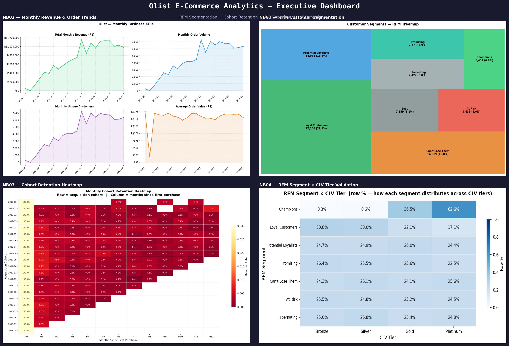

# E-Commerce Growth Analytics

End-to-end customer analytics pipeline built on the Olist Brazilian E-Commerce dataset (~100K orders, 96K customers, 2016–2018). The project goes from raw relational CSVs to a full customer intelligence framework covering segmentation, retention, experimentation, and lifetime value modelling, with outputs designed to support real marketing and product decisions.

---

## Business Problem

A growing e-commerce marketplace has no framework for distinguishing high-value customers from one-time buyers. Marketing spend is uniform across the customer base, free-shipping promotions run without rigorous measurement, and there is no forward-looking estimate of which customers are worth retaining. This project builds the analytical infrastructure to address all three gaps.

---

## What This Project Covers

**RFM Segmentation** — customers are scored on Recency, Frequency, and Monetary value using quintile-based scoring and assigned to eight named segments (Champions, Loyal Customers, At Risk, Lost, etc.). Segment summaries and visualisations are produced for direct use in campaign targeting.

**Cohort Retention Analysis** — all customers are grouped by their first purchase month and tracked across subsequent months. A retention heatmap, an average retention curve with confidence bands, and a repeat purchase rate breakdown by first-purchase category identify where and when customers churn.

**A/B Experiment Analysis** — orders with zero freight value are treated as a natural experiment for free-shipping promotions. The analysis includes a power analysis, covariate balance check, Welch t-test, Mann-Whitney robustness check, and OLS regression with HC3 robust standard errors to produce a regression-adjusted average treatment effect.

**CLV Modelling** — historical CLV aggregates the last 12 months of revenue per customer and assigns Bronze / Silver / Gold / Platinum tiers. Probabilistic CLV uses the BG/NBD model for purchase frequency and the Gamma-Gamma model for average spend to produce 12-month forward-looking revenue scores. A cross-validation heatmap confirms alignment between RFM segments and CLV tiers.

---

## Project Structure

```
amazon-ecommerce-analytics/
├── data/
│   ├── raw/                          # Olist CSVs — download separately (not in git)
│   └── processed/                    # Parquet files generated by notebook 01
│
├── notebooks/
│   ├── 01_data_loading_cleaning.ipynb
│   ├── 02_eda_kpi_definitions.ipynb
│   ├── 03_segmentation_cohort_analysis.ipynb
│   ├── 04_ab_testing_clv_modeling.ipynb
│   └── 05_executive_summary.ipynb
│
├── src/
│   ├── __init__.py
│   ├── data_processing.py            # Load, join, clean, feature engineering, validate
│   ├── segmentation.py               # RFM scoring, segment assignment, plots
│   ├── clv_model.py                  # Historical and probabilistic CLV
│   └── ab_testing.py                 # Experiment construction, tests, ATE estimation
│
├── outputs/
│   ├── figures/                      # All charts saved as PNG
│   └── tables/                       # Summary CSVs for reporting
│
├── requirements.txt
└── README.md
```

---

## Quick Start

### 1. Clone and install

```bash
git clone https://github.com/YOUR_USERNAME/amazon-ecommerce-analytics.git
cd amazon-ecommerce-analytics
python -m venv venv
source venv/bin/activate        # Windows: venv\Scripts\activate
pip install -r requirements.txt
```

### 2. Download the dataset

Download the Olist Brazilian E-Commerce dataset from Kaggle:
https://www.kaggle.com/datasets/olistbr/brazilian-ecommerce

Place all nine CSV files directly inside `data/raw/`. The expected filenames are:

```
olist_orders_dataset.csv
olist_order_items_dataset.csv
olist_order_payments_dataset.csv
olist_order_reviews_dataset.csv
olist_customers_dataset.csv
olist_products_dataset.csv
olist_sellers_dataset.csv
olist_sellers_dataset.csv
olist_geolocation_dataset.csv
product_category_name_translation.csv
```

### 3. Run the notebooks in order

```bash
jupyter notebook
```

Run notebooks 01 through 05 in sequence. Each notebook saves its outputs to `outputs/figures/` and `outputs/tables/`, which the next notebook loads. Running them out of order will cause missing-file errors.

---

## Libraries

| Library | Purpose |
|---|---|
| pandas, numpy | Data manipulation and numerical computing |
| matplotlib, seaborn | Visualisation |
| scipy | Statistical tests (t-test, Mann-Whitney) |
| statsmodels | OLS regression with HC3 robust standard errors |
| lifetimes | BG/NBD and Gamma-Gamma CLV models |
| squarify | Treemap visualisation for RFM segments |
| pyarrow | Parquet read/write |

Install everything with:

```bash
pip install pandas numpy matplotlib seaborn scipy statsmodels lifetimes squarify pyarrow jupyter
```

---

## Results

| Metric | Value |
|---|---|
| Total delivered orders | 96,477 |
| Unique customers | 93,357 |
| Overall repeat purchase rate | 3.00% |
| M1 cohort retention (avg across cohorts) | 0.48% |
| M3 cohort retention (avg across cohorts) | 0.25% |
| Champions segment: % of customers | 6.9% |
| Champions segment: % of revenue | 13.1% |
| Platinum CLV tier: % of customers | 25.0% |
| Platinum CLV tier: % of revenue | 59.2% |
| Free-shipping revenue lift (t-test) | −30.2% |
| Free-shipping lift p-value | < 0.0001 |
| Free-shipping Cohen's d | −0.301 |
| Regression-adjusted ATE (revenue) | −R$22.59 |
| Top entry category by repeat rate | home_appliances (8.74%) |
| Review score gap: fast vs slow delivery | 2.26 pts (4.43 → 2.17) |

### Executive Dashboard



### Cohort Retention Heatmap

Each row is a first-purchase cohort; each column is months since acquisition. The near-total drop after month 0 illustrates the 97% single-purchase rate and the narrow re-engagement window.


### RFM Segment Treemap

Area is proportional to segment revenue. Champions (top-right) account for 13.1% of revenue despite being only 6.9% of customers. Loyal Customers is the largest block by headcount.


---

## Dataset

**Olist Brazilian E-Commerce Public Dataset**  
Source: [Kaggle](https://www.kaggle.com/datasets/olistbr/brazilian-ecommerce)  
License: CC BY-NC-SA 4.0  
~150 MB across 9 CSV files, covering September 2016 to October 2018.
