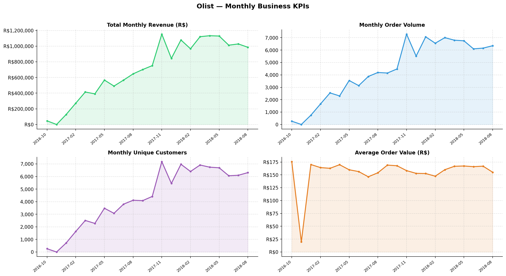
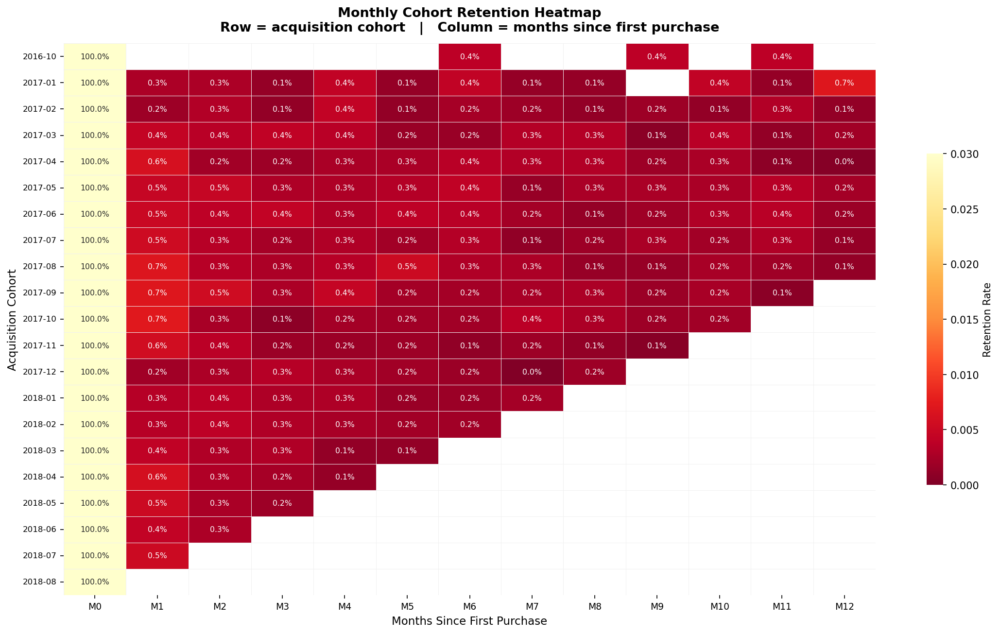
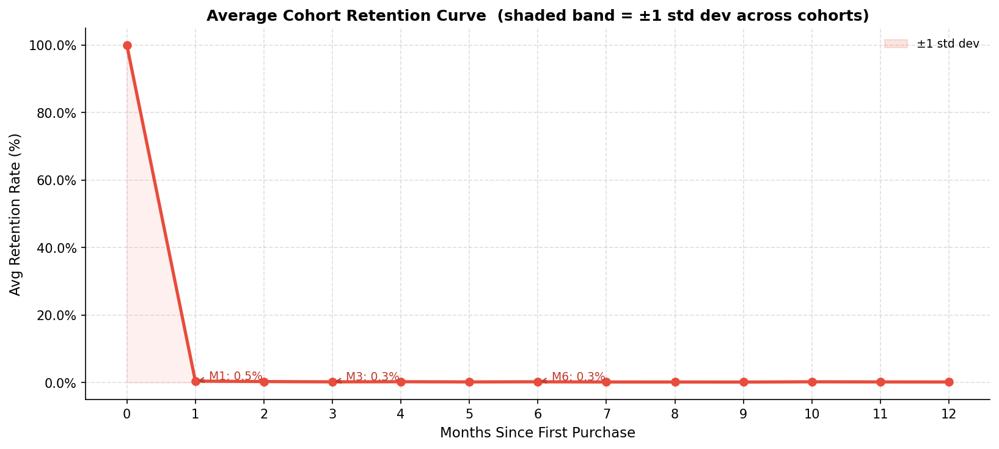
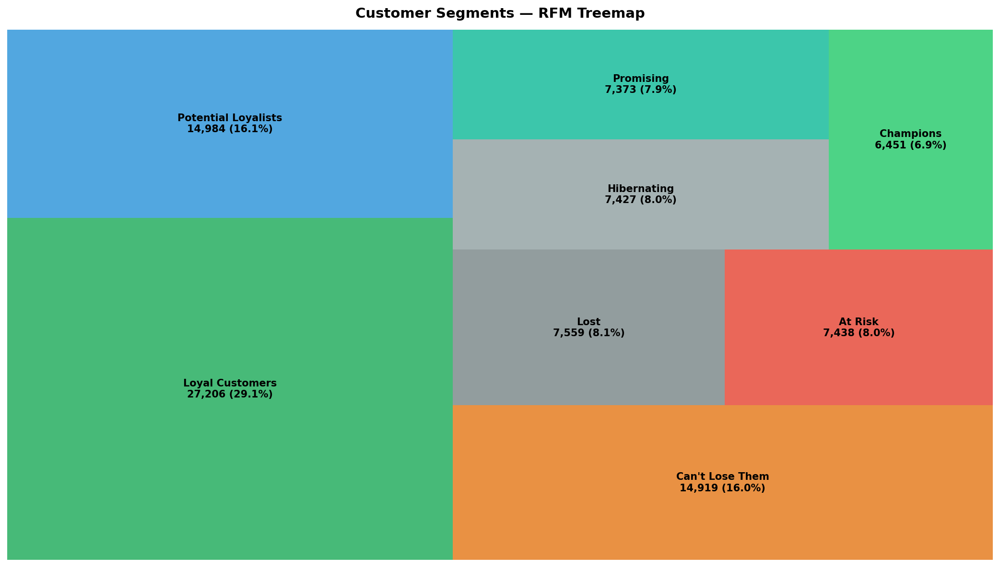
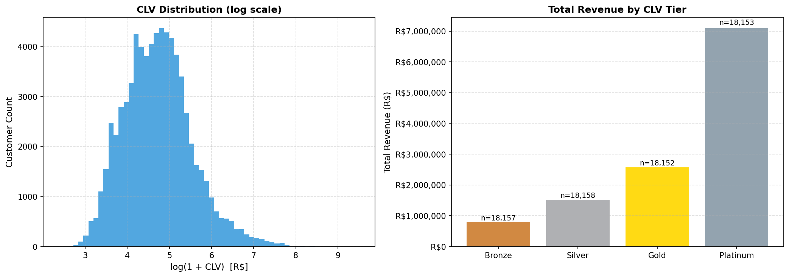
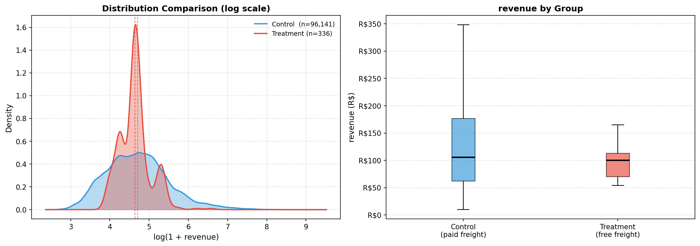
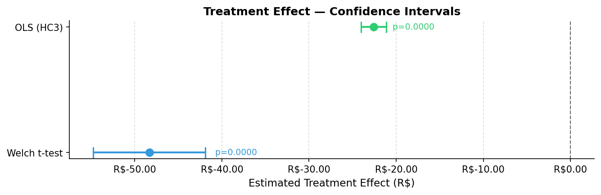
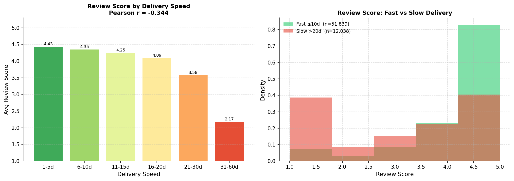
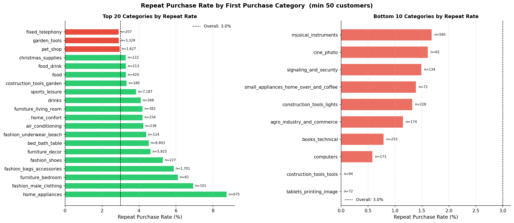

# Business Case: E-Commerce Growth Analytics

## Project Title
**E-Commerce Growth Analytics: RFM Segmentation, A/B Experiment Analysis, and Predictive CLV Modeling**

---

## Problem Statement

A mid-size e-commerce marketplace (modelled on the Olist platform) is growing top-line revenue but facing an inefficient marketing spend problem. The business has no framework to distinguish high-lifetime-value customers from one-time buyers, resulting in uniform promotional investment across the entire customer base.

Key symptoms observed:
- ~97% of customers place only one order (single-purchase rate is extremely high)
- Marketing budget is allocated uniformly — no CLV-based targeting
- Free-shipping promotions are offered without measuring impact on AOV or retention
- No segment-level understanding of which product categories attract high-value customers

---

## Business Objective

Build a customer analytics pipeline that enables the marketing team to:

1. **Segment** customers by predicted lifetime value (RFM + CLV model)
2. **Quantify** the revenue impact of free-shipping promotions via A/B analysis
3. **Identify** which product categories serve as high-LTV customer entry points
4. **Recommend** where to concentrate retention spend and how to define tier-based marketing programmes

---

## Target Stakeholders

| Stakeholder | Use of this analysis |
|---|---|
| VP Marketing | Budget allocation by CLV tier, segment targeting |
| Growth / CRM Team | Retention campaign triggers, win-back sequencing |
| Product Team | Category-level LTV index for inventory / merchandising decisions |
| Finance | Revenue forecasting using probabilistic CLV |

---

## Success Metrics (KPIs)

| KPI | Definition | Target |
|---|---|---|
| 90-Day Retention Rate | % of first-time buyers placing a 2nd order within 90 days | Baseline + improvement opportunity identified |
| 12-Month Historical CLV | Total revenue per customer in first 12 months | Segmented by tier; Pareto validation |
| Predicted CLV (12m) | BG/NBD + Gamma-Gamma forward forecast | Accuracy vs. held-out historical data |
| A/B Lift (AOV) | % change in avg order value: free shipping vs. paid | Statistical significance at α=0.05 |
| Revenue Concentration | % of revenue from top 20% of customers | Pareto (80/20) validation |
| Category LTV Index | Median CLV ratio: category X vs. overall baseline | Identify top 5 entry-point categories |

---

## Assumptions

1. **Customer identity**: We use `customer_unique_id` as the stable identifier across orders. Olist's actual repeat customer identification uses zip code + name matching, but `customer_unique_id` is reliable within this dataset.

2. **Revenue definition**: `payment_value` (from the payments table) is used as net order revenue. This includes instalment payments credited at purchase time and excludes returns (which are not tracked in this dataset version).

3. **Analysis period**: The primary analysis window is January 2017 – August 2018, covering the period of stable order volume. The 2016 data (partial year) is excluded from trend analysis but retained for cohort construction.

4. **A/B experiment proxy**: The experiment is constructed from observational data (free-shipping orders vs. paid-shipping orders). This is an observational design, not a true RCT. Confounders are controlled via regression. All conclusions are framed as correlational unless the regression-adjusted estimates align with the naive t-test.

5. **CLV horizon**: We estimate CLV over a 12-month forward window. For customers with < 4 weeks of tenure, CLV estimates are less reliable and are flagged.

---

## Scope Exclusions

- Real-time scoring pipeline (out of scope for a static portfolio project)
- Seller-side analytics (focus is customer-side)
- Geographic/geolocation deep-dive (available in the data but not the core thesis)

---

## Key Findings

*Numbers derived from outputs/tables/ after running notebooks 01–05.*

---

### Scale and Baseline

| KPI | Value |
|---|---|
| Total delivered orders | 96,477 |
| Unique customers | 93,357 |
| Dataset date range | Oct 2016 – Aug 2018 |
| Total revenue | R$15,422,462 |
| Average order value | R$159.86 |
| Median order value | R$105.28 |
| Repeat purchase rate | 3.00% |
| Single-purchase customers | 90,556 (97.0%) |
| Avg delivery days | 12.1 days |
| Avg review score | 4.156 / 5 |
| Total product categories | 71 |
| #1 category by revenue | health_beauty (R$1,413,963 — 9.3% share) |

---

### Retention

97% of customers never return. The table below shows how steeply retention falls after the first purchase — and that it never recovers past 0.5%.

| Months since first purchase | Avg retention % | Std dev | Cohorts tracked |
|---|---|---|---|
| M0 (acquisition) | 100.00% | ±0.00 | 21 |
| M1 | 0.48% | ±0.16 | 19 |
| M2 | 0.34% | ±0.08 | 18 |
| M3 | 0.25% | ±0.09 | 17 |
| M4 | 0.29% | ±0.10 | 16 |
| M6 | 0.27% | ±0.10 | 15 |
| M12 | 0.21% | ±0.20 | 8 |

The critical re-engagement window is the **first 30 days**. A post-purchase email sequence triggered within 24 hours of delivery is the single highest-leverage intervention available.

---

### Customer Segmentation (RFM)

Customers are scored on Recency, Frequency, and Monetary value and assigned to eight named segments. Champions are the smallest segment but punch far above their weight on revenue.

| Segment | Customers | % of customers | Avg order value | % of revenue |
|---|---|---|---|---|
| Loyal Customers | 27,206 | 29.1% | R$134 | 23.7% |
| Potential Loyalists | 14,984 | 16.1% | R$163 | 15.9% |
| Can't Lose Them | 14,919 | 16.0% | R$170 | 16.4% |
| Lost | 7,559 | 8.1% | R$160 | 7.9% |
| At Risk | 7,438 | 8.0% | R$162 | 7.8% |
| Hibernating | 7,427 | 8.0% | R$166 | 8.0% |
| Promising | 7,373 | 7.9% | R$154 | 7.4% |
| **Champions** | **6,451** | **6.9%** | **R$312** | **13.1%** |

Champions' average order value (R$312) is nearly **2× the platform average** (R$160). RFM segments align with CLV tiers, confirming RFM is a valid operational proxy for predicted LTV without running the full probabilistic model.

---

### CLV Concentration (Pareto)

Revenue distribution is far more concentrated than a classic 80/20 split — the **top quartile alone captures 59.2%** of all revenue.

| Tier | Customers | % of customers | Avg CLV | Median CLV | % of revenue |
|---|---|---|---|---|---|
| Bronze | 18,157 | 25.0% | R$43.67 | R$44.09 | 6.6% |
| Silver | 18,158 | 25.0% | R$83.95 | R$83.36 | 12.7% |
| Gold | 18,152 | 25.0% | R$141.55 | R$139.22 | 21.4% |
| **Platinum** | **18,153** | **25.0%** | **R$390.70** | **R$275.69** | **59.2%** |

Bottom half (Bronze + Silver) produces only 19.3% of revenue. Acquiring one Platinum customer is worth ~9× a Bronze customer in lifetime revenue.

---

### Free-Shipping Experiment

Free-shipping orders were compared against paid-shipping orders using a Welch t-test, Mann-Whitney test, and OLS regression with HC3 robust standard errors.

**Welch t-test results**

| Outcome | Control mean | Treatment mean | Estimate | Lift % | p-value | Cohen's d |
|---|---|---|---|---|---|---|
| Revenue (R$) | 160.02 | 111.70 | −48.32 | −30.2% | < 0.0001 | −0.301 |
| Item count | 1.14 | 1.13 | −0.01 | — | 0.633 | −0.023 |
| Review score | 4.16 | 4.39 | +0.23 | +5.6% | 0.0002 | +0.194 |

**Regression-adjusted ATE (OLS, HC3 robust SE)**

| Outcome | ATE estimate | 95% CI | p-value | R² |
|---|---|---|---|---|
| Revenue (R$) | −22.59 | [−24.05, −21.14] | < 0.0001 | 0.908 |
| Review score | +0.27 | [+0.16, +0.38] | < 0.0001 | 0.129 |

Free-shipping is associated with **−R$22.59 lower revenue per order** after controlling for item count, price, installments, delivery days, and cohort. The satisfaction benefit (+0.27 pts on review score) is real but does not offset the AOV impact. This is observational data — a randomised trial with an order-value threshold (e.g. free shipping on orders > R$150) is recommended before any policy change.

---

### Delivery & Satisfaction

Delivery speed has a strong, monotonic relationship with review score (Pearson r = −0.34, p < 0.0001).

| Delivery window | Avg review score | Median score | Orders |
|---|---|---|---|
| 1–5 days | 4.43 / 5 | 5.0 | 19,154 |
| 6–10 days | 4.35 / 5 | 5.0 | 32,685 |
| 11–15 days | 4.25 / 5 | 5.0 | 21,037 |
| 16–20 days | 4.09 / 5 | 5.0 | 10,636 |
| 21–30 days | 3.58 / 5 | 4.0 | 8,305 |
| 31–60 days | 2.17 / 5 | 1.0 | 3,733 |

The gap between the fastest and slowest bin is **2.26 points** — a drop from near-perfect ratings to predominantly 1-star reviews. Orders taking 31–60 days represent 3,733 customers who are almost certainly lost permanently.

---

### Entry Category & Loyalty

The category a customer buys from first is a strong predictor of whether they will return. Top 10 entry categories by repeat rate:

| Entry category | Customers | Repeat rate | Avg spend (R$) |
|---|---|---|---|
| home_appliances | 675 | 8.74% | 138.12 |
| fashion_male_clothing | 101 | 6.93% | 126.76 |
| furniture_bedroom | 82 | 6.10% | 280.24 |
| fashion_bags_accessories | 1,701 | 5.88% | 106.76 |
| fashion_shoes | 227 | 5.29% | 128.00 |
| furniture_decor | 5,925 | 4.62% | 149.57 |
| bed_bath_table | 8,803 | 4.53% | 141.46 |
| fashion_underwear_beach | 114 | 4.39% | 100.70 |
| air_conditioning | 236 | 4.24% | 254.90 |
| home_confort | 334 | 4.19% | 182.55 |

Platform repeat rate baseline: **3.00%**. Home appliances entrants return at nearly 3× that rate. Acquisition campaigns targeting these entry categories produce customers with structurally higher predicted LTV.

